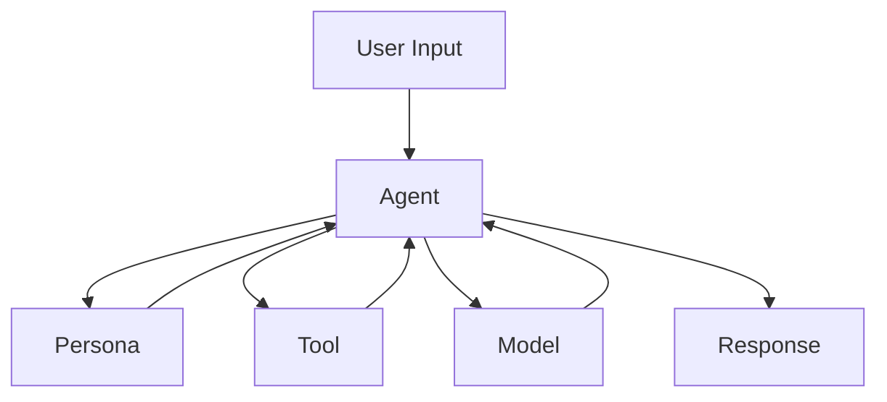

# Basic Agent With Tool (ADK)

This repository demonstrates a simple agent implementation using the Agent Development Kit (ADK).

## Files
- `hello_agent.py`: Main script to run the agent.

## Usage
1. Clone the repository.
2. Install dependencies:
   - `python-dotenv`
   - `google-adk` (or your custom ADK package)
3. Set up your environment variables in a `.env` file (not included in the repo).
4. Run the script:
   ```bash
   python hello_agent.py
   ```


## Agent Workflow Diagram



## Workflow Explanation

- **User Input**: The user provides a query or instruction.
- **Agent**: Central orchestrator. Receives input, decides how to process it.
- **Persona**: Defines the agent's behavior, style, and instructions (system prompt).
- **Tool**: Optional. Used by the agent for specific tasks (e.g., search, calculation, API calls).
- **Model**: The LLM or AI model that generates responses or processes data.
- **Response**: The agent returns the final output to the user.

### When to Call What
- The **Agent** always receives user input first.
- The **Persona** is referenced to guide the agent's behavior.
- The **Tool** is called if the agent needs to perform a specific function (e.g., fetch data, transform input).
- The **Model** is called to generate or process natural language responses.

### Purpose of Each Component
- **Agent**: Orchestrates the workflow, manages persona, tools, and model calls.
- **Persona**: Customizes agent's responses and style.
- **Tool**: Extends agent capabilities beyond the model (e.g., external APIs, calculations).
- **Model**: Generates intelligent responses and processes language.

---
The `.env` file is excluded for security. Add your own locally for API keys and configuration.
Make sure the `google.adk` package is available in your Python environment.
